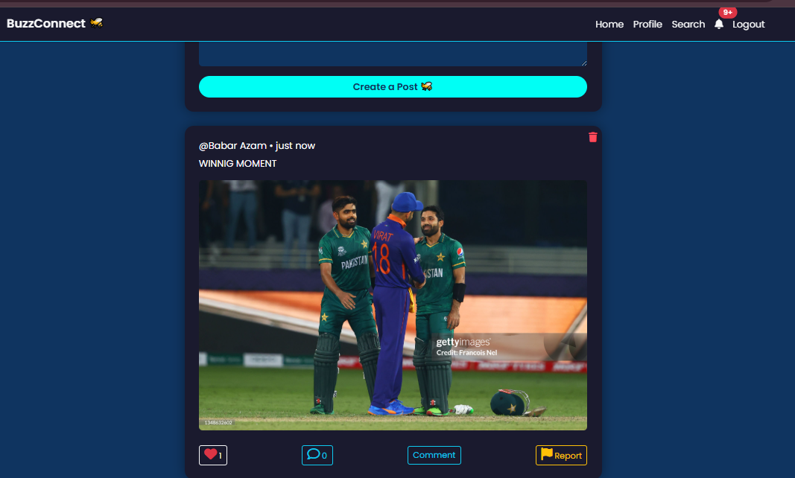
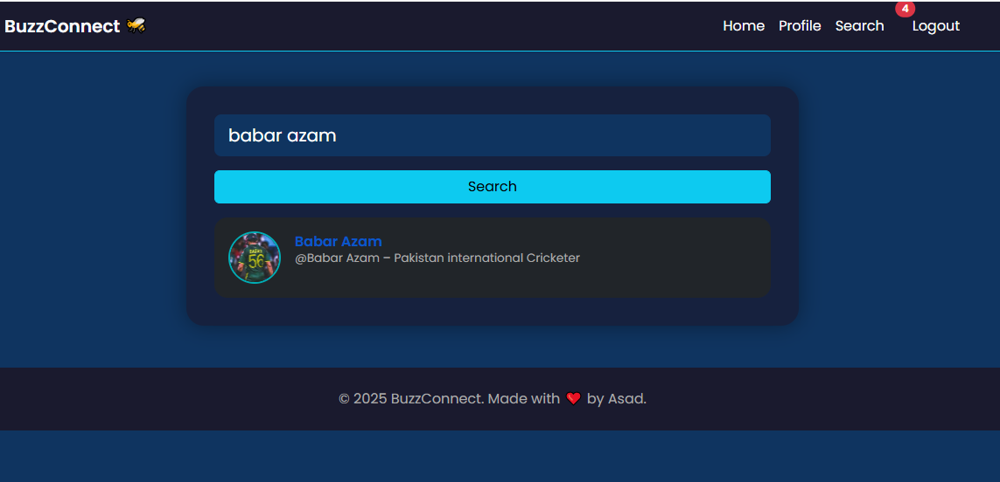
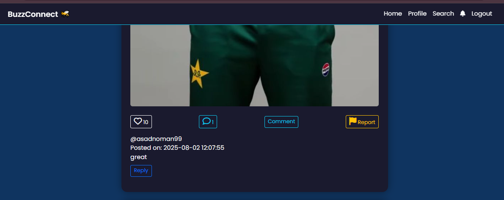
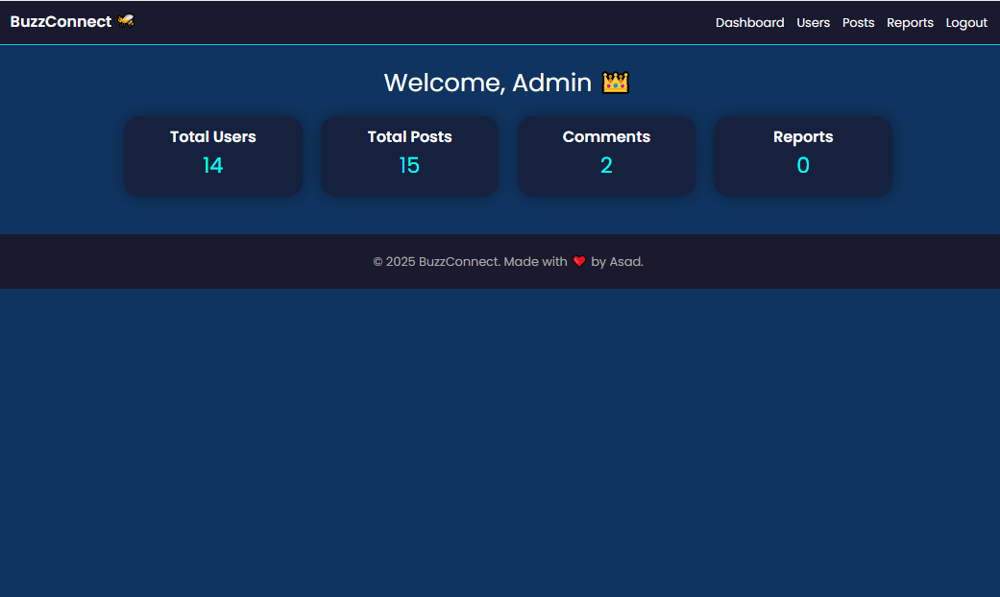
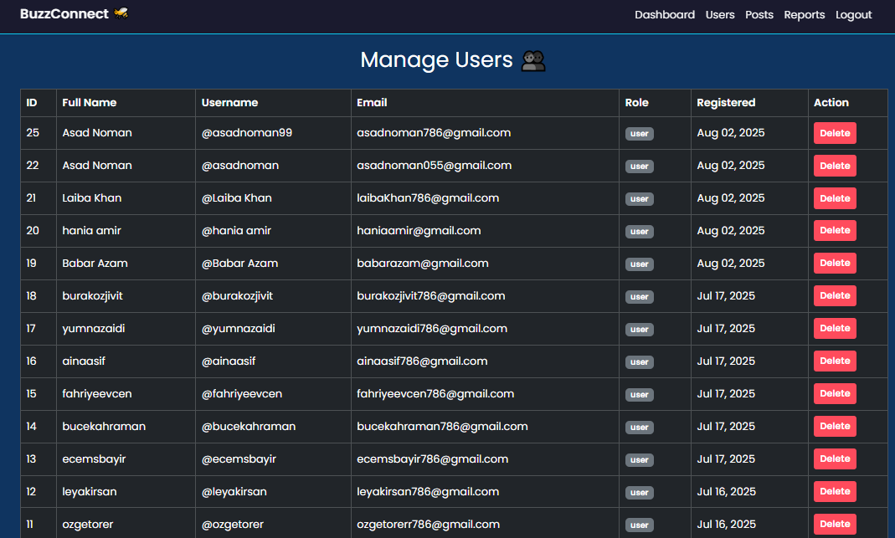
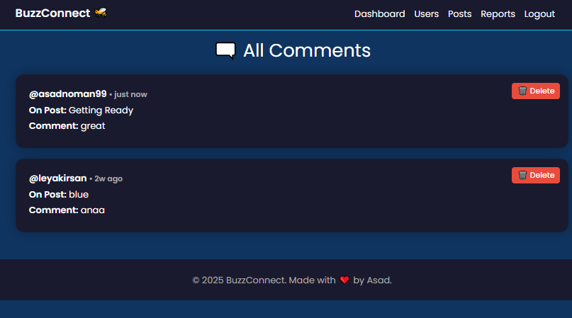
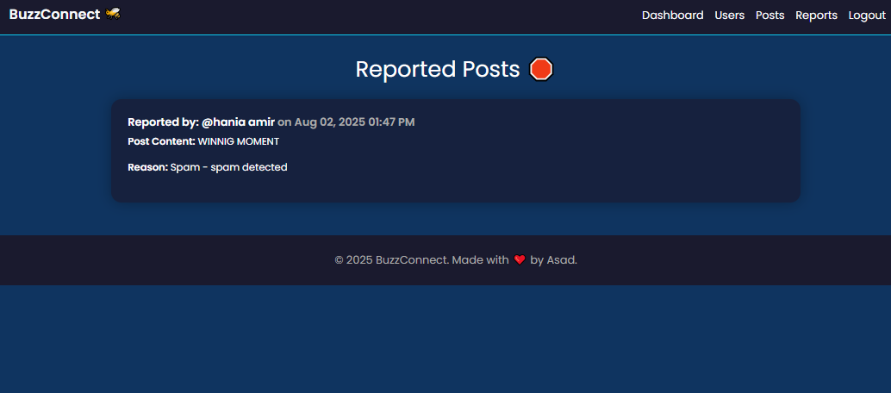

# 🔗 BuzzConnect – Social Media Web App (PHP + MySQL)

 <!-- Optional: Replace with your banner -->

BuzzConnect is a modern social media platform built from scratch using **PHP**, **MySQL**, **JavaScript**, and **Bootstrap**. It allows users to create posts, like, comment, reply, follow other users,get notifications of someone like,commment and follow and report inappropriate content. Admins can manage reports via the backend. Ideal for learning full-stack social media functionality.

---

## 📸 Key Screenshots

| Dashboard | Profile Page | Search | Notifications | Post with Comments |  
|-----------|--------------|--------|---------------|--------------------|  
|  | |  |  |  |

| Admin Panel  | Total users|Total Posts | Comments | Reports |
|--------------|------------|------------|----------|---------|
|  |  |  ||  |  

---

## ✨ Features

### 🧑‍💻 General Users
- Register, login, and create profile
- Create, edit, and delete posts (with optional image upload)
- Like and comment on posts (with real-time like count)
- Nested replies under comments
- Follow/unfollow other users
- Report inappropriate posts
- See comment and like icons update dynamically

### 🔐 Admin Panel
- Manage Posts
- Manage Users
- Manage Comments 
- View and manage user-submitted reports
- Delete reported content
- Moderate the platform from the backend

---

## 🛠️ Tech Stack

| Frontend         | Backend     | Database |
|------------------|-------------|----------|
| HTML, CSS, Bootstrap 5 | Core PHP     | MySQL    |
| JavaScript (AJAX)      | PDO          | Session-based auth |

---

## 📂 Folder Structure

- `/users/` – User features like profiles, dashboard, follow system
- `/admin/` – Admin panel and report management
- `/assets/` – CSS, JS, images
- `/includes/` – DB connection, auth, reusable functions
- `/posts/` – Post creation, deletion, and display logic
- `/comments.php` – Comment and nested reply logic

---

## 📄 Pages Overview

- `register.php` / `login.php` – User authentication
- `dashboard.php` – Main feed showing posts
- `profile.php` – User profile with posts & follow button
- `create_post.php` – Post creation with optional image
- `comments.php` – View and reply to post comments
- `reports.php` – Admin-only: view user reports

---

## 🚀 Getting Started (Run Locally)

1. **Clone the Repository**
   ```bash
   git clone https://github.com/AsadNoman55/BuzzConnect-SocialMediaApp

